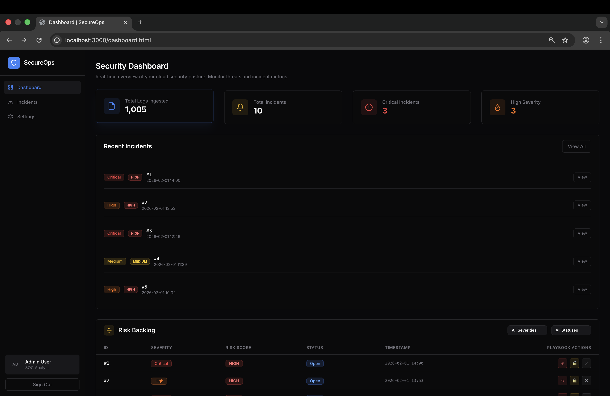
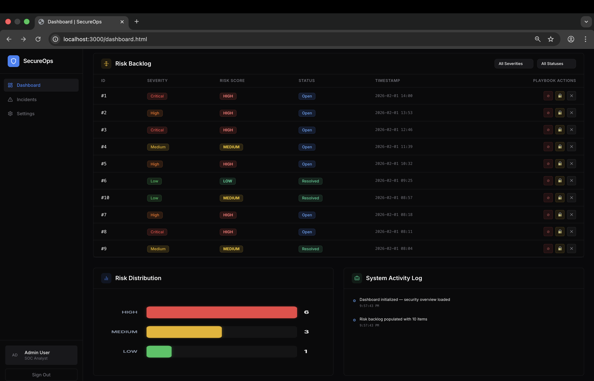
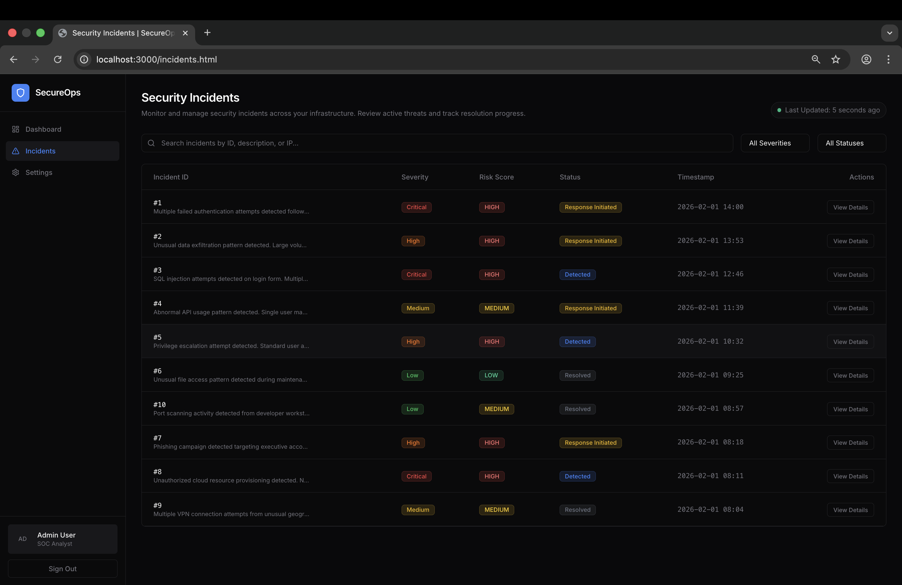
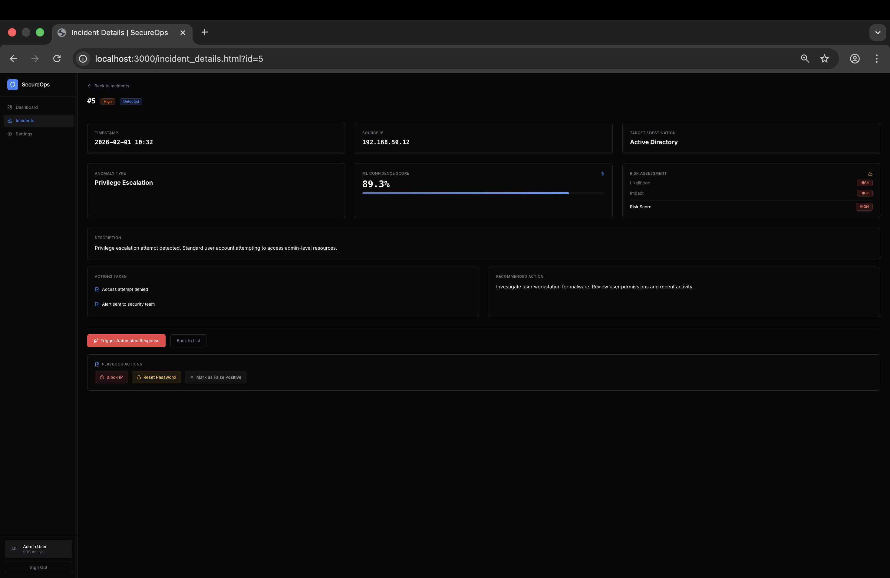
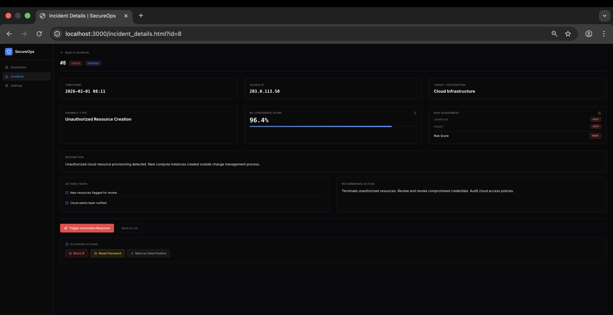
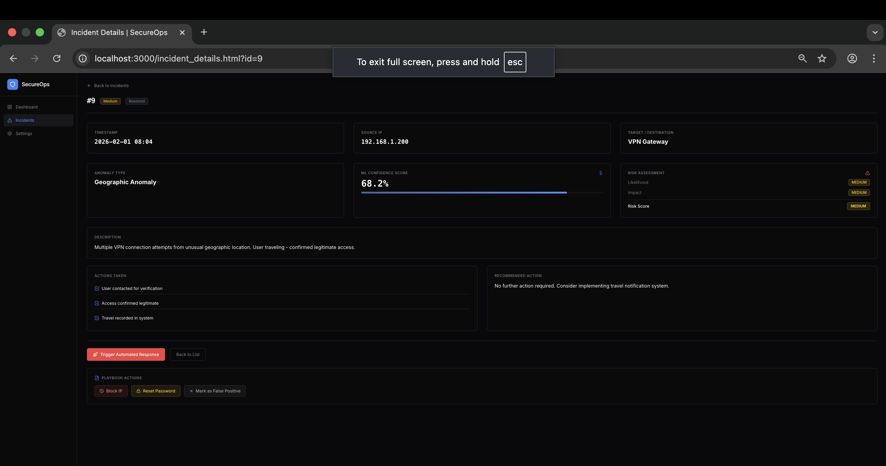
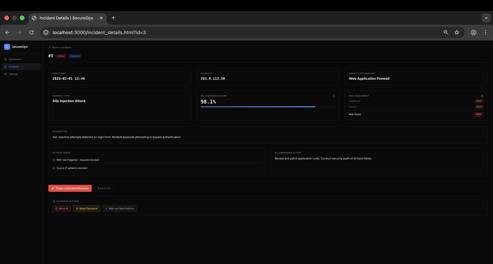

# AI-Driven Cloud Security Incident Detection & Response Platform

A full-stack cybersecurity dashboard that uses Machine Learning to detect anomalies in security logs and automate incident response.

## 🎯 Features

### Core Platform
- **JWT Authentication** with role-based access (Admin/Analyst)
- **ML-Powered Anomaly Detection** using Isolation Forest
- **Severity Classification** using Random Forest
- **Automated Incident Response** based on severity levels
- **Real-time Dashboard** with security metrics
- **Incident Management** with detailed views and response actions

### Risk Management & Response (New)
- **Risk Scoring System** — each incident gets a computed risk level (High/Medium/Low) based on severity × confidence, displayed with color-coded badges (red/yellow/green)
- **Risk Backlog Panel** — Agile-inspired backlog view with filterable table (by severity and status), showing incident ID, risk score, status, and timestamps
- **Playbook Actions (Simulated SOAR)** — one-click incident response: Block IP, Reset Password, Mark as False Positive — updates UI state and logs actions
- **System Activity Log** — timestamped feed tracking all dashboard events, playbook executions, and risk updates
- **Risk Visualization** — animated canvas bar chart showing risk distribution (High/Medium/Low counts) with no external libraries

## 🏗️ Architecture

```
┌──────────────────────────────────────────────────────────────────────┐
│                           Frontend                                    │
│                 HTML / Tailwind CSS / Vanilla JS                      │
│  ┌────────────────────────────────────────────────────────────────┐   │
│  │  Dashboard  │  Risk Backlog  │  Risk Chart  │  Activity Log   │   │
│  │  Incidents  │  Incident Details + Risk Assessment              │   │
│  │  Playbook Actions (SOAR Simulation)                            │   │
│  └────────────────────────────────────────────────────────────────┘   │
│  ┌────────────────────────────────────────────────────────────────┐   │
│  │  Client-Side Modules: Risk Scoring Engine, Backlog State,     │   │
│  │  System Log, Canvas Chart Renderer                            │   │
│  └────────────────────────────────────────────────────────────────┘   │
└──────────────────────────────────────────────────────────────────────┘
                                │
                                ▼
┌──────────────────────────────────────────────────────────────────────┐
│                        FastAPI Backend                                │
│    ┌──────────────────────────────────────────────────────────┐       │
│    │  API Layer: Auth, Logs, Incidents, Dashboard             │       │
│    └──────────────────────────────────────────────────────────┘       │
│    ┌─────────────────────┐    ┌───────────────────────────────┐      │
│    │   ML Pipeline       │    │    Service Layer              │      │
│    │  - Isolation Forest │    │  - Incident Creation          │      │
│    │  - Random Forest    │    │  - Response Execution         │      │
│    └─────────────────────┘    └───────────────────────────────┘      │
│    ┌──────────────────────────────────────────────────────────┐       │
│    │          SQLite Database (SQLAlchemy)                    │       │
│    └──────────────────────────────────────────────────────────┘       │
└──────────────────────────────────────────────────────────────────────┘
```

## 📸 Screenshots

### 1. Security Dashboard (Detect & Assess)
*Top: High-level metrics and recent real-time alerts. Bottom: Deep dive into the Risk Backlog, severity distribution, and system logs.*



### 2. Incident List
*A filterable view of all anomalies promoted to security incidents.*


### 3. Incident Details & SOAR Playbooks (Respond)
*In-depth telemetry, ML assessment details, and simulated response actions (SOAR).*





## 🚀 Quick Start

### Prerequisites

- Python 3.9+
- pip

### 1. Install Dependencies

```bash
cd backend
pip install -r requirements.txt
```

### 2. Start the Backend

```bash
cd backend
uvicorn app.main:app --reload --port 8000
```

The backend will:
- Initialize the SQLite database
- Train ML models automatically (if not already trained)
- Seed demo data (users and sample incidents)

### 3. Open the Frontend

Open `frontend/index.html` in your browser:

```bash
open frontend/index.html
# or on Linux: xdg-open frontend/index.html
# or just double-click the file
```

### 4. Login

Use demo credentials:
- **Admin**: `admin` / `admin123`
- **Analyst**: `demo` / `demo123`

## 📁 Project Structure

```
├── backend/
│   ├── app/
│   │   ├── api/              # API endpoints
│   │   │   ├── auth.py       # Login & JWT
│   │   │   ├── logs.py       # Log ingestion
│   │   │   ├── incidents.py  # Incident CRUD
│   │   │   └── dashboard.py  # Dashboard stats
│   │   ├── core/             # Core utilities
│   │   │   ├── config.py     # Configuration
│   │   │   └── security.py   # JWT & auth
│   │   ├── db/               # Database
│   │   │   ├── database.py   # SQLAlchemy setup
│   │   │   └── models.py     # ORM models
│   │   ├── ml/               # Machine Learning
│   │   │   ├── train_models.py
│   │   │   ├── inference.py
│   │   │   └── models/       # Saved models
│   │   ├── services/         # Business logic
│   │   │   ├── incident_service.py
│   │   │   └── response_service.py
│   │   ├── utils/
│   │   │   └── logger.py
│   │   └── main.py           # FastAPI app
│   └── requirements.txt
│
├── frontend/
│   ├── index.html            # Login page
│   ├── dashboard.html        # Dashboard + Risk Backlog + Chart + Activity Log
│   ├── incidents.html        # Incident list + Risk Score column
│   ├── incident_details.html # Incident details + Risk Assessment + Playbook
│   ├── style.css             # Styling
│   └── app.js                # Frontend logic + Risk/SOAR modules
│
├── project_storyline.md
├── PROJECT_MANAGEMENT_README.md
└── README.md
```

## 🔌 API Endpoints

| Method | Endpoint | Description |
|--------|----------|-------------|
| POST | `/api/auth/login` | User login, returns JWT |
| GET | `/api/dashboard/stats` | Dashboard metrics |
| GET | `/api/incidents` | List all incidents |
| GET | `/api/incidents/{id}` | Incident details |
| POST | `/api/incidents/{id}/respond` | Trigger response |
| POST | `/api/logs` | Ingest security log |

## 🤖 ML Pipeline

### Anomaly Detection (Isolation Forest)
- Trained on synthetic normal behavior patterns
- Detects unusual patterns in security logs
- Features: failed attempts, data transfer, request rate, time, geo

### Severity Classification (Random Forest)
- Classifies detected anomalies into: Low, Medium, High, Critical
- Based on feature patterns from the log data

### Training
Models are trained automatically on first run using synthetic data that simulates:
- Normal user behavior
- Brute force attacks
- Data exfiltration
- API abuse
- Privilege escalation

## 🚨 Automated Response

| Severity | Actions |
|----------|---------|
| Low | Log only |
| Medium | Alert security team |
| High | Block IP + High priority alert |
| Critical | Block IP + Disable user + Forensics |

*Note: Response actions are simulated in this demo version.*

## 📊 Risk Management (SIEM/SOAR-Inspired)

### Risk Scoring
Each incident is assigned a computed risk score based on two factors:
- **Likelihood** — derived from severity (Critical/High → High, Medium → Medium, Low → Low)
- **Impact** — derived from ML confidence score (≥80% → High, 50-80% → Medium, <50% → Low)
- **Risk Level** = max(Likelihood, Impact) → displayed as color-coded badges

### Risk Backlog
An Agile-style backlog panel on the dashboard tracks all incidents with:
- Filterable by severity and status (Open / Investigating / Resolved)
- Inline playbook action buttons per row
- Live updates when actions are executed

### Playbook Actions (Simulated SOAR)
| Action | Effect |
|--------|--------|
| Block IP | Updates status to Investigating, logs action |
| Reset Password | Updates status to Investigating, logs action |
| Mark False Positive | Updates status to Resolved, logs action |

### System Activity Log
A scrollable feed that tracks all dashboard events with timestamps and type icons (⚙ system, ⚡ action, ⚠ risk). Capped at 50 entries.

### Risk Visualization
Animated horizontal bar chart (pure HTML5 Canvas, zero dependencies) showing the count of High, Medium, and Low risk incidents with glowing color accents.

## 🔒 Security Features

- JWT-based authentication
- Password hashing with bcrypt
- Role-based access control
- Audit logging for all actions

## 📊 Demo Mode

The system comes pre-seeded with:
- 2 demo users (admin and analyst)
- 10 sample security incidents
- 1000+ log entries
- Pre-trained ML models

This allows for immediate demonstration without real data.

## 🎓 For Viva/Presentation

Key points to explain:

1. **Login Flow**: JWT authentication with token storage
2. **Dashboard**: Real-time metrics from database + risk backlog + activity log
3. **ML Pipeline**: Feature extraction → Anomaly detection → Severity classification
4. **Risk Scoring**: How likelihood × impact is computed from severity and confidence
5. **SOAR Playbooks**: Simulated incident response actions (Block IP, Reset Password, False Positive)
6. **Incident Response**: Automated actions based on severity
7. **Risk Visualization**: Canvas-based chart with animated bar rendering
8. **Architecture**: Clean separation of concerns (API, Services, ML, DB)
9. **Agile Concepts**: Risk backlog inspired by Agile sprint backlogs with status tracking
10. **SIEM/SOAR Integration**: How the system mirrors enterprise security orchestration workflows

## 📝 License

MIT License - Free for educational and commercial use.
